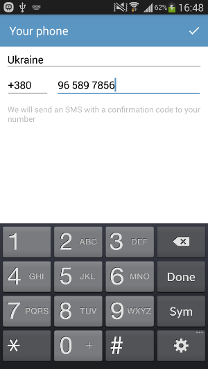
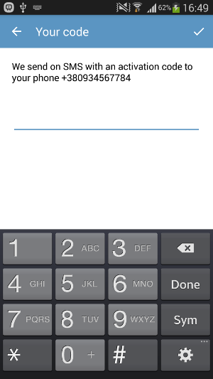
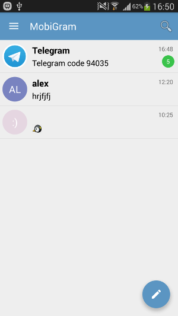
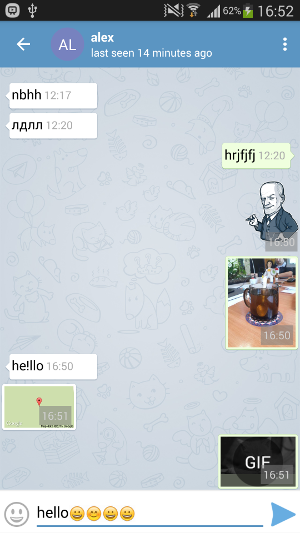
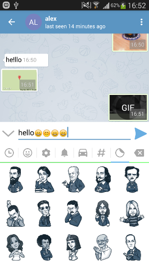
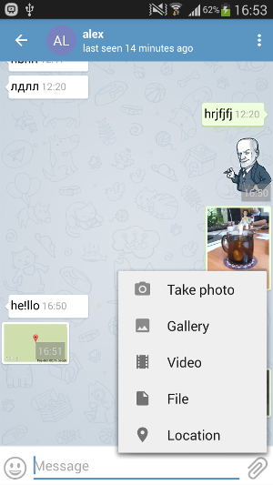
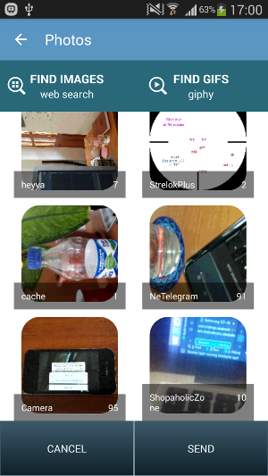
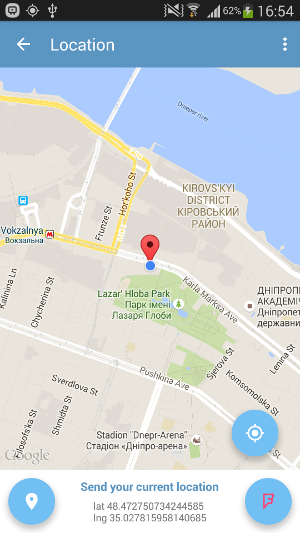

### MobiGram

## Description
 We present to you our project MobiGram!!! This is sample of chat application which based on Telegram API. 
 Application requires is not less Android 4.0.3 and it work with portrait and landscape orientation. 
 The purpose of this app make your communication pleasant and interesting. 
 Of course, there are in the application and multimedia features. MobiGram offers to send photos, videos, gif and your location. 
 You can send photos from your gallery, or select it on the Internet, also you will find a great selection of emoticons. 
 It is very convenient.

##### Developers: 
    * Alexandr Tsymbal  (alex.tsymbal@mobindustry.net)
    * Oleg Vovk  (oleg.vovk@mobindustry.net)